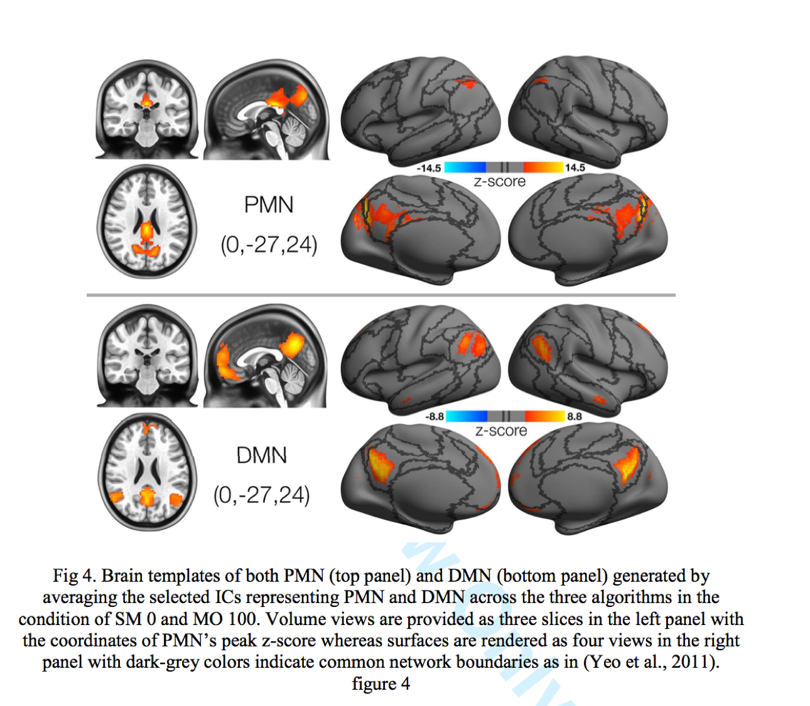
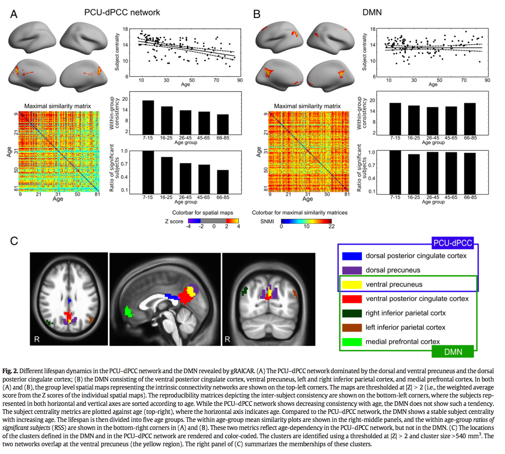

# Parietal Memory Network (PMN) and Default Model Network (DMN) Templates

This repository shares spatial brain templates for two intrinsic connectivity network (ICN) templates, the **parietal memory network (PMN)** and the **default mode network (DMN)**.

## Rationale

- The **DMN** is a well known instrinsic connectivity network in the brain, and there have been numerous studies reporting its relevance to disease, cogition functions, and conciousness.
- The **PMN** is a relatively recent name that refers to an intrinsic connectivity network in the brain that anchors at two parietal areas including the precuneus and the posterior cingulate. This name comes from the findings that this network is involved in processing novelty of memory (Gilmore et al., 2015, Trends in Cognitive Sciences).
- The PMN and DMN are spatially adjacent and even over overlap in certain midline regions (see the figure below, from Yang et al., 2014), so that seed voxel-based functional analyses may have the risk to merge the two networks as one.

- However, the separation between PMN and DMN have been supported by studies using cognitive tasks  (Gilmore et al., 2015, Trends in Cognitive Sciences), large-scale resting-state network analysis (Yeo et al., 2011; Power et al., 2011), and life-span brain development (Yang et al., 2014).

- A practical approach to separate PMN from DMN is independent component analysis (ICA) on resting state fMRI data, but due to technical complexity, the implementation is not a trivial. 

- Here we provide a set of spatial templates of PMN and DMN. These templates were generated by averaging the results from 3 group-level ICA algorithms (temporal concatenate ICA, gRAICAR, and independent vector analysis). The data used were a healthy sample from Chinese-Han population. We hope these templates could help researchers to better distinguish PMN and DMN when conducting brain network studies.

- We hope you could cite the following publications if these template is useful for you:

  - Hu Y, Wang J, Li C, Wang Y-S, Yang Z*, Zuo X-N (2016). Segregation
    between the parietal memory network and the default mode network: effects
    of spatial smoothing and model order in ICA. Sci Bull. 61 (24):1844-1854.

  - Yang Z*, Chang C, Xu T, Jiang L, Handwerker D, Castellanos F, Milham
    M, Bandettini P, Zuo X* (2014). Connectivity trajectory across lifespan
    differentiates the precuneus from the default network. NeuroImage 89, 45-56.

## Techinical Details

Please see Hu et al., 2016 for details on how the ICA were performed using three algorithms. The following paragraph is a simple description for generating the templates:

_To provide a set of reference templates on PMN and DMN for future studies, we averaged the Z-transformed group-level ICs representing PMN and DMN across the three algorithms (temporal concatenate ICA, gRAICAR, and independent vector analysis) in the smooth 0 and model order 100 condition to generate a set of PMN and DMN RSN templates. Both surface and volume files for the PMN and DMN templates are publicly available._

## Usage

- Under the _"mean_across_algorithms"_ directory, there are two directories, _"volume"_ and _"free surfer"_, storing PMN and DMN maps in volume (.nii.gz) and cortical surface format (fsaverage.nii.gz)
- Under the _"volume"_ directory, templates of 2mm and 3mm resolutions are provided.
- The values in the PMN/DMN maps are Z scores, and the users could set a cut-off threshold like |Z|>2 or |Z|>3 to convert them into binary masks and extract ROI as they need.
